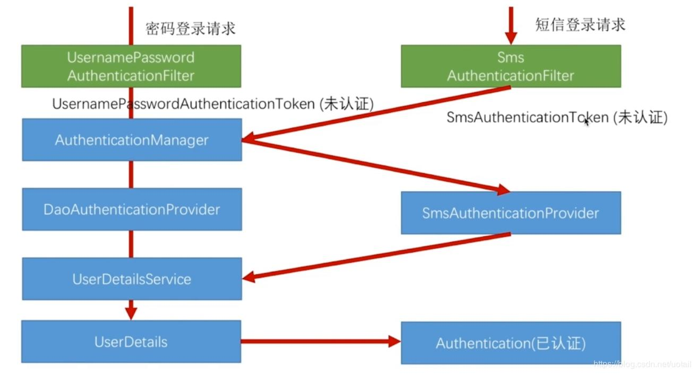
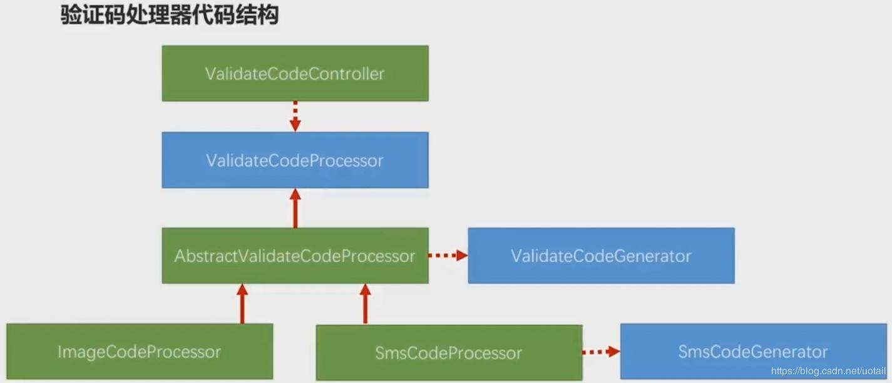
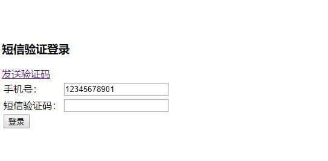

# 跟我学spring security系列文章第四章 短信验证码登录

源码地址:

https://github.com/pony-maggie/spring-security-learn

短信验证码登录是现在比较流行的一种登录方式，各大网站，APP基本都支持这种登录方式。本文就实现一个基本的短信验证码登录示例。

## 原理分析

从前面几个章节，我们已经基本了解spring security内置的用户名密码验证机制。但是短信验证这种定制化的功能需要我们自己实现。不过好在我们可以参考用户名密码验证的大部分逻辑实现。基本流程如下图所示： 




验证码处理的核心代码结构是这样的：




生成验证码的流程整理下：

1. 先进入ValidateCodeController并且接收{type}，因为本文只实现了短信验证码，所以type是"sms"，也可以是"image"表示图形验证码。
2. 进入ValidateCodeProcessorHolder，找到Spring的组件中对应的处理器返回。
3. 进入AbstractValidateCodeProcessor，getValidateCodeType根据请求的url获取校验码的类型。
4. 获取validateCodeGenerator，进入生成校验码的逻辑中。

其实顺着代码阅读，会发现思路很清晰，并且简单。

## 示例实现

### SmsCodeAuthenticationToken

在使用帐号密码登录的时候，UsernamePasswordAuthenticationToken里面包含了用户的帐号，密码，以及其他的是否可用等状态信息。我们是通过手机短信来做登录，所以就没有密码了。

```java
public class SmsCodeAuthenticationToken extends AbstractAuthenticationToken {
	...
	public SmsCodeAuthenticationToken(String mobile) {
		super(null);
		this.principal = mobile;
		setAuthenticated(false);
	}
    ...
```

这里只贴出了关键部分的代码，其实我们自定义的这个token核心在于把mobile当做是principal，密码相关的去掉了。token我理解是认证信息的载体，所以你会看到代码里很多地方都会用到它。


### SmsCodeAuthenticationFilter

帐户密码登录的流程使用的是UsernamePasswordAuthenticationFilter，它的作用是从请求中获取帐户、密码，请求方式校验，生成token。 我们根据短信验证码的实际情况进行修改。

```java
public class SmsCodeAuthenticationFilter extends AbstractAuthenticationProcessingFilter {


	// ~ Methods
	// ========================================================================================================

	@Override
	public Authentication attemptAuthentication(HttpServletRequest request, HttpServletResponse response)
			throws AuthenticationException {
		logger.info("*********attemptAuthentication********");
		if (postOnly && !request.getMethod().equals("POST")) {
			//当前请求如果不是post请求则抛出异常
			throw new AuthenticationServiceException("Authentication method not supported: " + request.getMethod());
		}

		String mobile = obtainMobile(request);//从请求中获取mobile参数

		if (mobile == null) {
			mobile = "";
		}

		mobile = mobile.trim();

		//实例化token
		SmsCodeAuthenticationToken authRequest = new SmsCodeAuthenticationToken(mobile);

		// Allow subclasses to set the "details" property
		setDetails(request, authRequest);


		//使用AuthenticationManager 调用 token
		return this.getAuthenticationManager().authenticate(authRequest);
	}
	...
```

在attemptAuthentication方法中，主要是通过手机号，生成一个我们自己定义的token对象，然后进行进一步的验证。 我们需要把这个filter通过HttpSecurity的addFilterAfter方法添加到spring security的过滤器链条中去。


### SmsCodeAuthenticationProvider 

在帐号密码登录的过程中，密码的正确性以及帐号是否可用是通过DaoAuthenticationProvider来校验的。我们也应该自己实现一个短信验证码的Provier。
这个provider的实例需要在配置类中设置到HttpSecurity的authenticationProvider中，向spring security表明这是我们要使用的认证provider。


```java
public class SmsCodeAuthenticationProvider implements AuthenticationProvider {

	private static final Logger logger = LoggerFactory.getLogger(SmsCodeAuthenticationProvider.class);

	private UserDetailsService userDetailsService;

	@Override
	public Authentication authenticate(Authentication authentication) throws AuthenticationException {

		logger.info("**********authenticate*********");

		SmsCodeAuthenticationToken authenticationToken = (SmsCodeAuthenticationToken) authentication;

		String principal = (String) authenticationToken.getPrincipal();//token中的手机号
		UserDetails user = userDetailsService.loadUserByUsername(principal);//根据手机号拿到对应的UserDetails

		if (user == null) {
			throw new InternalAuthenticationServiceException("无法获取用户信息");
		}
		
		SmsCodeAuthenticationToken authenticationResult = new SmsCodeAuthenticationToken(user, user.getAuthorities());
		
		authenticationResult.setDetails(authenticationToken.getDetails());

		return authenticationResult;
	}
	...
```

前面的章节我们讲过，AuthenticationProvider本身并不处理认证流程，而是委托给AuthenticationProvider，我们这里就是SmsCodeAuthenticationProvider。所以下面的代码：

```java
//使用AuthenticationManager 调用 token
return this.getAuthenticationManager().authenticate(authRequest);
```

实际上是调用SmsCodeAuthenticationProvider中的authenticate方法。


### SmsCodeAuthenticationSecurityConfig

签名很多地方提到了加入配置，就是通过这个类操作的。

```java
@Component
public class SmsCodeAuthenticationSecurityConfig extends SecurityConfigurerAdapter<DefaultSecurityFilterChain, HttpSecurity> {

    ...
	@Override
	public void configure(HttpSecurity http) throws Exception {

		logger.info("**************configure**********");
		
		SmsCodeAuthenticationFilter smsCodeAuthenticationFilter = new SmsCodeAuthenticationFilter();
		smsCodeAuthenticationFilter.setAuthenticationManager(http.getSharedObject(AuthenticationManager.class));

		smsCodeAuthenticationFilter.setAuthenticationSuccessHandler(whaleAuthenticationSuccessHandler);
		smsCodeAuthenticationFilter.setAuthenticationFailureHandler(whaleAuthenticationFailureHandler);
		
		SmsCodeAuthenticationProvider smsCodeAuthenticationProvider = new SmsCodeAuthenticationProvider();
		smsCodeAuthenticationProvider.setUserDetailsService(userDetailsService);
		
		http.authenticationProvider(smsCodeAuthenticationProvider)
			.addFilterAfter(smsCodeAuthenticationFilter, UsernamePasswordAuthenticationFilter.class);
		
	}
	...
```

最后我们要把这个配置加入项目的主配置文件中，

```java
@Override
    protected void configure(HttpSecurity http) throws Exception {

        http.formLogin().loginPage("/login").defaultSuccessUrl("/user").permitAll()
                .and().logout().permitAll()
                .logoutSuccessHandler(logoutSuccessHandler())
//                .logoutSuccessUrl("/login")
                .deleteCookies("remember-me")
                .and()
                .apply(validateCodeSecurityConfig)
                .and()
                .apply(smsCodeAuthenticationSecurityConfig)
                .and()
                .authorizeRequests().antMatchers("/code/sms",
                SecurityConstants.DEFAULT_SIGN_IN_PROCESSING_URL_FORM,
                SecurityConstants.DEFAULT_SIGN_IN_PROCESSING_URL_MOBILE).permitAll()
                .anyRequest().authenticated()
                .and()
                .csrf().disable();

    }

```


**更多代码可以去下载源码查看**。

## 测试

启动spring boot，然后浏览器中输入:

http://localhost:9090/

然后会自动跳转到登录页面，



先点击发送短信验证码，然后通过日志查看生成的验证码（因为我们并没有接入真实的短信通道）。

然后返回到登录页面，输入验证码提交表单。


参考:

http://www.programmersought.com/article/42231107973/
